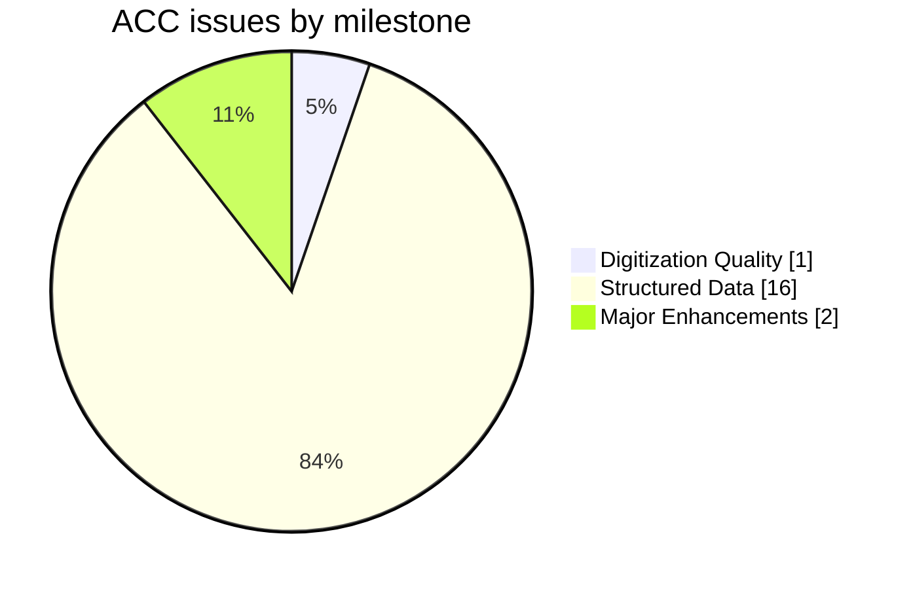
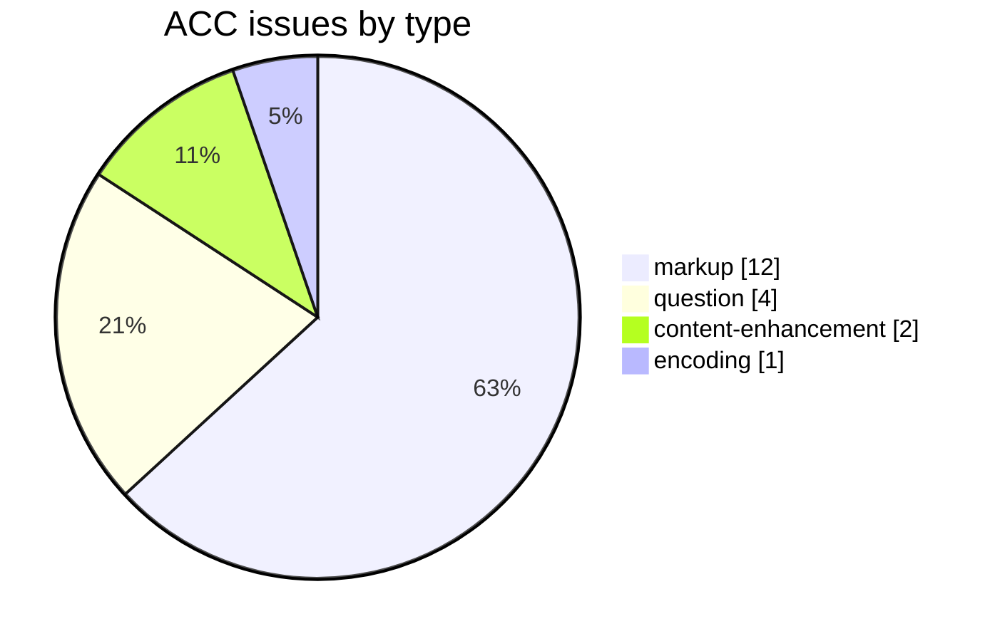
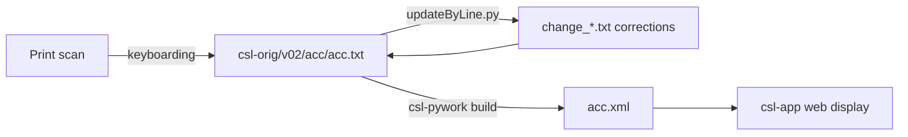

# ACC — Aufrecht *Catalogus Catalogorum* (1891–1903)

Development and correction repository for **Theodor Aufrecht's *Catalogus Catalogorum: an Alphabetical Register of Sanskrit Works and Authors***, a bibliographic catalogue of Sanskrit works and their authors, part of the [Cologne Digital Sanskrit Lexicon](https://www.sanskrit-lexicon.uni-koeln.de/) (CDSL). The canonical source text lives in [`csl-orig/v02/acc/acc.txt`](https://github.com/sanskrit-lexicon/csl-orig/blob/master/v02/acc/acc.txt) (32,576 catalog entries); this repository holds the development, correction, and enrichment work.

A *meta*-work: its entries are Sanskrit **work and author names** with subject tags (e.g. `jy.` jyotiṣa, `poet`, `archit.`) and references to manuscript catalogues — not a word-dictionary.

## Documentation

- [CLAUDE.md](CLAUDE.md) — repository guide and data-format reference.
- [DATA_DICTIONARY.md](DATA_DICTIONARY.md) — markup tag reference.
- [CONTRIBUTING.md](CONTRIBUTING.md) · [CODE_OF_CONDUCT.md](CODE_OF_CONDUCT.md)

## Timeline

| Period | Activity |
|---|---|
| 2017 | Repository activity begins (first tracked issues) |
| 2026-05 | Issue taxonomy, citation metadata, documentation |

## Projects & Milestones

| Milestone | Open | Closed | Total |
|---|---|---|---|
| Dictionary to Book | 0 | 0 | 0 |
| Digitization Quality | 0 | 1 | 1 |
| Structured Data | 9 | 7 | 16 |
| Major Enhancements | 1 | 1 | 2 |
| **Total** | **10** | **9** | **19** |

## Issues

### Open

| # | Title | Type | Severity | Milestone |
|---|---|---|---|---|
| 2 | Analyze non-English words in decreasing order of occurren… | question | minor | Structured Data |
| 4 | Exploring significance of <HI> tag | question | minor | Structured Data |
| 5 | Flag non-English words which are not headwords for examin… | question | minor | Structured Data |
| 7 | Potentially missed literary resources | markup | minor | Structured Data |
| 12 | downstream modifications for XML and display | content-enhancement | medium | Major Enhancements |
| 14 | locatives in headword | markup | minor | Structured Data |
| 15 | Rewrite literary resource tagging for long tags | markup | minor | Structured Data |
| 16 | multiword headword tagging issues | markup | minor | Structured Data |
| 17 | Request to review acc6.txt | question | minor | Structured Data |
| 18 | <HI> tag importance, part 2 | markup | minor | Structured Data |

### Solved

| # | Title | Type | Severity | Milestone |
|---|---|---|---|---|
| 1 | Document Literary sources in ACC | content-enhancement | medium | Major Enhancements |
| 3 | Internal references in ACC | markup | minor | Structured Data |
| 6 | 97 duplicate tagging in acc6.txt | markup | minor | Structured Data |
| 8 | Sole occurrence of § | encoding | minor | Digitization Quality |
| 9 | Odd spacing issues in acc3.txt | markup | minor | Structured Data |
| 10 | mis-tags in acc4.txt | markup | minor | Structured Data |
| 11 | mis-tags in acc4.txt | markup | minor | Structured Data |
| 13 | xml problems with markup | markup | minor | Structured Data |
| 19 | [markup] Minor acc.txt Markup Oddities | markup | minor | Structured Data |

## Labels

### Type labels

| Label | Meaning |
|---|---|
| `link-target` | Click-throughs from `<ls>` abbreviations to scanned PDF pages |
| `link-splitting` | Splitting combined `SOURCE N,N` refs into per-page links |
| `markup` | Normalising XML tag content |
| `text-correction` | Corrections to English/Sanskrit definitions or headwords |
| `content-enhancement` | New material or structural additions beyond correction |
| `encoding` | SLP1/IAST transcoding, character normalisation |
| `scan-quality` | Replacing blurry/skewed/missing scan pages |
| `bug` | Broken links, XML errors, broken downloads |
| `question` | Scholarly questions requiring research |

### Severity labels

| Label | Meaning |
|---|---|
| `minor` | Targeted fix — a handful of lines or a single file |
| `medium` | Standard unit of work — one batch of corrections |
| `hard` | Large effort spanning many sources or files |

## Contributors

| Contributor | Commits |
|---|---|
| gasyoun (Mārcis Gasūns) | 8 |
| drdhaval2785 | 1 |

## Source

- **Author**: Aufrecht, Theodor
- **Title**: *Catalogus Catalogorum: an Alphabetical Register of Sanskrit Works and Authors*
- **Place / Publisher**: Leipzig: F. A. Brockhaus
- **Year(s)**: 1891–1903
- **Volumes**: 3 parts
- **Language pair**: Sanskrit (bibliographic catalog)
- **Size (CDSL headword index)**: 32,576 catalog entries
- **License (digital edition)**: CC BY-SA 4.0
- See [CITATION.cff](CITATION.cff) for machine-readable citation.

## Encoding

- UTF-8 (NFC) throughout.
- Sanskrit text in SLP1 transliteration, wrapped in `{#…#}`; English gloss / italic display text in ``.
- Devanāgarī and IAST display forms are generated at display time, not stored in the source.

## How it works

---
*Issue taxonomy and documentation per the [Cologne issue runbook](https://github.com/sanskrit-lexicon/csl-observatory/blob/main/runbook/cologne-issue-runbook.md).*
