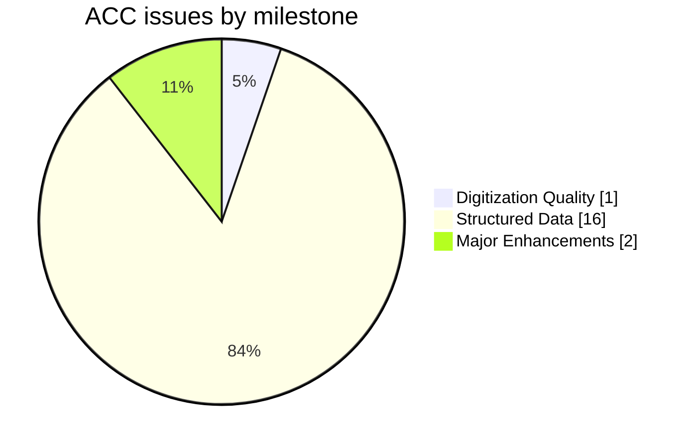
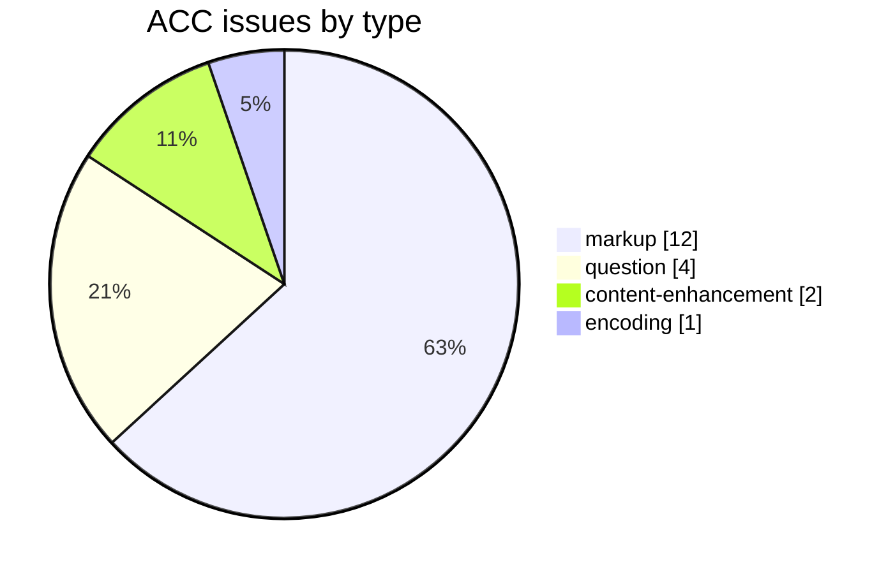
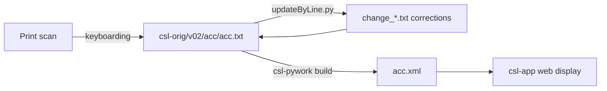

# ACC — Aufrecht *Catalogus Catalogorum* (1891–1903)

_Created: 16-05-2026 · Last updated: 11-07-2026_

Aufrecht's *Catalogus Catalogorum* is the closest thing pre-digital Sanskrit
studies had to a union catalogue: a 19th-century, three-volume alphabetical
register of Sanskrit **works and their authors**, listing which work is
attested in which library collection, under which variant title/spelling. It
predates any modern authority-file or union catalog for Sanskrit manuscripts,
and remains a standard first stop for "does a manuscript of this text exist,
and where" — the reason it was digitized as part of the
[Cologne Digital Sanskrit Lexicon](https://www.sanskrit-lexicon.uni-koeln.de/)
(CDSL), alongside the dictionaries proper.

It is a *meta*-work: its entries are Sanskrit **work and author names** with
subject tags (e.g. `jy.` jyotiṣa, `poet`, `archit.`) and references to
manuscript catalogues — not a word-dictionary. The canonical source text lives
in [csl-orig/v02/acc/acc.txt](https://github.com/sanskrit-lexicon/csl-orig/blob/main/v02/acc/acc.txt)
(49,833 `<L>` entry records; 48,230 distinct L-numbers); this repository holds
the development, correction, and enrichment work and tracks corrections as
GitHub issues under the shared Sanskrit Lexicon taxonomy.

## Documentation

- [CLAUDE.md](https://github.com/sanskrit-lexicon/ACC/blob/main/CLAUDE.md) — repository guide and data-format reference.
- [DATA_DICTIONARY.md](https://github.com/sanskrit-lexicon/ACC/blob/main/DATA_DICTIONARY.md) — markup tag reference (`<L>`, `<k1>`, `<lex>`, `<ls>`).
- [CONTRIBUTING.md](https://github.com/sanskrit-lexicon/ACC/blob/main/CONTRIBUTING.md) · [CODE_OF_CONDUCT.md](https://github.com/sanskrit-lexicon/ACC/blob/main/CODE_OF_CONDUCT.md)
- [changelog.md](https://github.com/sanskrit-lexicon/ACC/blob/main/changelog.md) — SemVer release history.
- [CITATION.cff](https://github.com/sanskrit-lexicon/ACC/blob/main/CITATION.cff) — machine-readable citation for Aufrecht 1962.

Corrections are never made to the source file directly — they are expressed as
change files applied by scripts, per the canonical
[correction-workflow doc](https://github.com/sanskrit-lexicon/csl-corrections/blob/main/docs/correction-workflow.md).

## What's actually in this repo

At the root level, ACC carries only the org-standard project metadata — no
entry text, no scripts. That is not an oversight: the raw ACC text lives in
[csl-orig](https://github.com/sanskrit-lexicon/csl-orig), and per-dictionary
correction records live in
[CORRECTIONS/dictionaries/ACC](https://github.com/sanskrit-lexicon/CORRECTIONS/tree/main/dictionaries/ACC).
This repo is the issue-tracking and citation home for the ACC dictionary
specifically, not a data mirror.

## A real correction, verified against the audit trail

Corrections to ACC are logged, not applied blind. One entry from
[ACC_correctionform.txt](https://github.com/sanskrit-lexicon/CORRECTIONS/blob/main/dictionaries/ACC/ACC_correctionform.txt)
(read directly, not invented):

```
Case 23811: 09/11/2017 dict=ACC, L=37452, hw=vESvatmyarahasya, user=dhaval
old = vESvatmyarahasya
new = vESvAtmyarahasya
comment = typo
status =  Corrected 09/11/2017
```

As of that file's last count: **155 correction records, 0 pending** for ACC. A
second file in the same directory,
[acc-fuzzyalpha.txt](https://github.com/sanskrit-lexicon/CORRECTIONS/blob/main/dictionaries/ACC/faultfinder/acc-fuzzyalpha.txt),
holds a fuzzy-alphabetization consistency check specific to ACC's
manuscript-title sort order — the kind of structural check a catalogue needs
that a normal dictionary doesn't.

## Timeline

| Period | Activity |
|---|---|
| 2017 | Repository activity begins (first tracked issues) |
| 2026-05 | Issue taxonomy, citation metadata, documentation |

## Projects & Milestones

Issue counts below are current as of 11-07-2026.

| Milestone | Open | Closed | Total |
|---|---|---|---|
| Dictionary to Book | 0 | 0 | 0 |
| Digitization Quality | 0 | 1 | 1 |
| Structured Data | 8 | 8 | 16 |
| Major Enhancements | 1 | 1 | 2 |
| **Total** | **9** | **10** | **19** |



## Issues



### Open

| # | Title | Type | Severity | Milestone |
|---|---|---|---|---|
| 2 | Analyze non-English words in decreasing order of occurren… | question | minor | Structured Data |
| 5 | Flag non-English words which are not headwords for examin… | question | minor | Structured Data |
| 7 | Potentially missed literary resources | markup | minor | Structured Data |
| 12 | downstream modifications for XML and display | content-enhancement | medium | Major Enhancements |
| 14 | locatives in headword | markup | minor | Structured Data |
| 15 | Rewrite literary resource tagging for long tags | markup | minor | Structured Data |
| 16 | multiword headword tagging issues | markup | minor | Structured Data |
| 17 | Request to review acc6.txt | question | minor | Structured Data |
| 18 | `<HI>` tag importance, part 2 | markup | minor | Structured Data |

### Solved

| # | Title | Type | Severity | Milestone |
|---|---|---|---|---|
| 1 | Document Literary sources in ACC | content-enhancement | medium | Major Enhancements |
| 3 | Internal references in ACC | markup | minor | Structured Data |
| 4 | Exploring significance of `<HI>` tag | question | minor | Structured Data |
| 6 | 97 duplicate tagging in acc6.txt | markup | minor | Structured Data |
| 8 | Sole occurrence of § | encoding | minor | Digitization Quality |
| 9 | Odd spacing issues in acc3.txt | markup | minor | Structured Data |
| 10 | mis-tags in acc4.txt | markup | minor | Structured Data |
| 11 | mis-tags in acc4.txt | markup | minor | Structured Data |
| 13 | xml problems with markup | markup | minor | Structured Data |
| 19 | [markup] Minor acc.txt Markup Oddities | markup | minor | Structured Data |

## Labels

### Type labels

| Label | Meaning |
|---|---|
| `link-target` | Click-throughs from `<ls>` abbreviations to scanned PDF pages |
| `link-splitting` | Splitting combined `SOURCE N,N` refs into per-page links |
| `markup` | Normalising XML tag content |
| `text-correction` | Corrections to English/Sanskrit definitions or headwords |
| `content-enhancement` | New material or structural additions beyond correction |
| `encoding` | SLP1/IAST transcoding, character normalisation |
| `scan-quality` | Replacing blurry/skewed/missing scan pages |
| `bug` | Broken links, XML errors, broken downloads |
| `question` | Scholarly questions requiring research |

### Severity labels

| Label | Meaning |
|---|---|
| `minor` | Targeted fix — a handful of lines or a single file |
| `medium` | Standard unit of work — one batch of corrections |
| `hard` | Large effort spanning many sources or files |

## Contributors

| Contributor | Commits |
|---|---|
| gasyoun (Mārcis Gasūns) | 8 |
| drdhaval2785 | 1 |

## Source

- **Author**: Aufrecht, Theodor
- **Title**: *Catalogus Catalogorum: an Alphabetical Register of Sanskrit Works and Authors*
- **Place / Publisher**: Leipzig: F. A. Brockhaus
- **Year(s)**: 1891–1903
- **Volumes**: 3 parts
- **Language pair**: Sanskrit (bibliographic catalog)
- **Size (source text)**: 49,833 `<L>` entry records (48,230 distinct L-numbers)
- **License (digital edition)**: CC BY-SA 4.0
- See [CITATION.cff](https://github.com/sanskrit-lexicon/ACC/blob/main/CITATION.cff) for machine-readable citation.

## Encoding

- UTF-8 (NFC) throughout.
- Sanskrit text in SLP1 transliteration, wrapped in `{#…#}`; English gloss / italic display text in ``.
- Devanāgarī and IAST display forms are generated at display time, not stored in the source.

## How it works



The correction step above is standardised across every CDSL dictionary — see the
canonical [correction-workflow doc](https://github.com/sanskrit-lexicon/csl-corrections/blob/main/docs/correction-workflow.md)
for the full snapshot → change-file → validate → promote procedure.

---

_Issue taxonomy and documentation per the [Cologne issue runbook](https://github.com/sanskrit-lexicon/csl-observatory/blob/main/runbook/cologne-issue-runbook.md)._

_Dr. Mārcis Gasūns_
